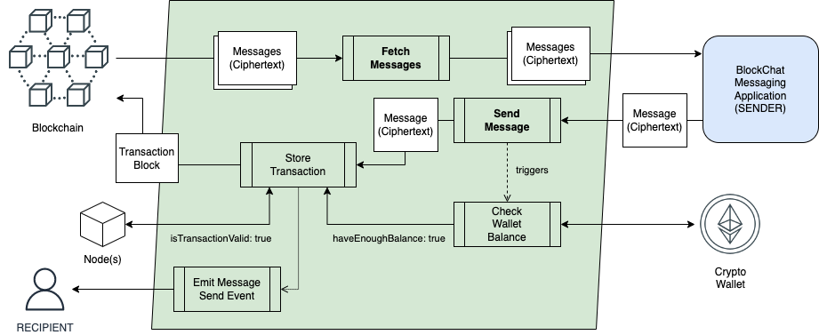
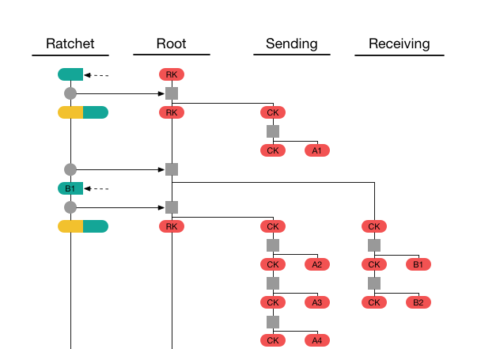

# block-chat

Many popular messaging applications require a centralized server to deliver messages between users. We propose our application, BlockChat, which uses blockchain to deliver encrypted messages as an alternative to existing messaging applications. Our approach should give users confidence that messages can only be read by the sender and receiver, and the properties inherent to blockchain should provide message integrity and authentication. However, decentralization and the costs associated with sending messages makes BlockChat a hard choice to consider as an individual's main secure messaging application. 

## Chat System

Our project can be split into four major components:
- the implementation of the blockchain network,
- smart contracts,
- message encryption, and
- local storage

### Blockchain Network

The blockchain network acts as a distributed data structure that stores messages in encrypted form. 
Our usage of the blockchain was decided largely because of the properties it offers in terms of immutability and decentralization. We recognized that these were imperative to have in a modern messaging app. By relying on a decentralized ledger, a central authority should have a hard time censoring communication between participants or preventing them altogether. 
Using blockchain technology helps ensure message integrity and authenticity.

### Smart Contracts

Smart contracts act as the delivery mechanism on the blockchain that allows users to send and fetch messages from the blockchain. Our system’s messaging logic is governed largely by smart contracts that are written on top of the Ethereum blockchain. 
The smart contracts are written in Solidity, a high-level programming language specifically created for the development of smart contracts on a number of blockchain networks. Conveniently, Solidity features functionality that supports modular design and data type validation. 

### Message Encryption - [Signal](from https://signal.org/en/) Protocol

To ensure confidentiality, the messages are encrypted using the Signal protocol, which utilizes the [Double Ratchet algorithm](https://signal.org/docs/specifications/doubleratchet/
)to generate new keys for each message while also allowing messages to be received out of order. 
The main goal of this algorithm is to be able to use unique message keys for each message and to allow parties to communicate without having to exchange the needed decryption keys beforehand.

Messages are encrypted using AES-256 in CBC cipher mode and an HMAC will be used to provide integrity. 

### Local Storage

The application will securely store the sent and received messages in an encrypted local database. Storing the messages on the user’s system allows for messages to be reviewed offline, and encrypting the messages ensures that malicious actors will have a hard time reading the messages even if they have access to the user’s system.

## Prototype

We evaluated our system design by developing a prototype web application. We also utilized Metamask and Ganache to test the functionality of the smart contract on a local blockchain. 
The web application is developed using the following libraries/frameworks:
- [React](https://react.dev/)
- NodeJS - [Crypto library](https://nodejs.org/api/crypto.html)
- [web3](https://github.com/web3/web3.js)
- [truffle](https://trufflesuite.com/truffle/)

